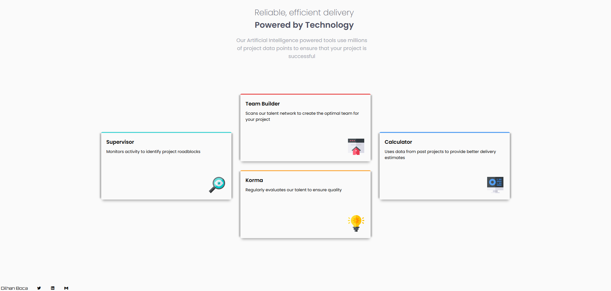

# Frontend Mentor - Four Card Feature Section Master

## Table of contents

- [Process](#process)
- [Screenshot](#screenshot)
- [What I learned](#what-i-learned)
- [Future Improvements](#future-improvments)
- [Author](#author)

## Process

 I used a combination of GRID, Flexbox and Position 
 througout the layout. Changing from three columns down 
 to one on smaller screen sizes was crucial for the layout. 

 Also, using position: absolute on the footer was key to putting it 
 at the bottom of the page. Using the relative/absolute combo 
 was also key for accurately positioning the descriptive images 
 inside the card components. 

## Screenshot



## What I learned

**1. The importance of min-height && height: fit-content**

***Min-Height***

Within this layout, -- on large screen
sizes: the header has a min-height of 10vh, the main 
has a min-height of 70vh. It's important to remember that as these 
are minimums, the content can push these sections to larger sizes 
with no issue. These minimums can be taken off on smaller 
screen sizes; adjust as required. 

***height: fit-content***

The footer in this website uses fit-content, which is great when we 
simply want the container to be no more than the height of 
the feature content. 

---------------------------------------
<br>
<br>

**2. Position: absolute on the footer**

***Getting the footer to stay at the bottom of the page***

Firstly, one must make sure that position: relative is placed 
on the body. Then the following code is placed on the footer:

```
  position: absolute;
  top: calc(100% - 1.5rem); 
  height: fit-content;
  bottom: 0rem;
  left: 0rem;
  width: 100vw;
```
The 1.5rem corresponds roughly to the height of the content. Try 
this method in a few other contexts to see its effectiveness, but 
it seems to work quiet well. However, we have -- on smaller screen
sizes -- changed it to static, this is something also worth investigating. Perhaps this is only suitable for a single landing page -- and would require 
a fixed length on a website with vertically longer pages. 

---------------------------------------
<br>
<br>

**3. Using __ margin: auto 0 __ to vertically center within GRID**

***Keeping the card vertically centered***

As we can see the cards on the left and the right are vertically centered
within a grid context by using: 

```
margin: auto 0; 
```
---------------------------------------
<br>
<br>

**4. A mixture of fixed and variable tools to create responsive height**

***The card components use both rem and vh***

```
 height: calc(11.5rem + 5.5vh);
```
This creates a scenario where the cards get slightly taller on larger 
screen sizes; helping the responsiveness of the website.

---------------------------------------
<br>
<br>

**5. A mixture of of variable calc and :root to limit padding**
***The padding gets slightly larger on larger screen sizes***
```
      padding-top: min(calc(2.5vh + 1vw), var(--max-padding));
```
This property only applies on larger screen sizes, but the idea is to 
center the main section a little bit on larger screen sizes, but having 
the --max-padding limit to prevent it going past this on the rare 
super-wide screen. The definition of this in the root can be seen below:

```
  :root {
    --max-padding: 5rem; 
  }
```
For whatever reason, defining this variable with the other SASS variables
did not work at all. Does anyone know why this is the case ?

---------------------------------------
<br>
<br>

## Future Improvements

As one can see from the screenshot provided, I have not been able to get the 
box-shadow to go around the curved corners. I tried to achive this with 
pseudo-elements, but to no avail. If someone could show me how to do this 
or where I could learn I would be grateful. 

***UPDATE***

1. Provided by someone on FM: 
  ```
    box-shadow: 0 0 0.625rem 0.625rem rgba(0, 0, 0, 20%);
  ```
2. CHAT GPT Extension focusing on not having it on the 
top (didn't really work to be honest.)
```
   box-shadow: 0 0.625rem 0.625rem rgba(0, 0, 0, 0%), /* Shadow on top (hidden) */
            0.625rem 0 0.625rem rgba(0, 0, 0, 20%), /* Shadow on right */
            0 0.625rem 0.625rem rgba(0, 0, 0, 20%), /* Shadow on bottom */
            -0.625rem 0 0.625rem rgba(0, 0, 0, 20%); /* Shadow on left */
```


***Thanks so much!!!***

---------------------------------------
<br>
<br>

## Author 

Dilhan Boca

- Frontend Mentor - [@dboca93](https://www.frontendmentor.io/profile/dboca93)
- Twitter - [@dboca93](https://www.twitter.com/dboca93)

dboca93@gmail.com