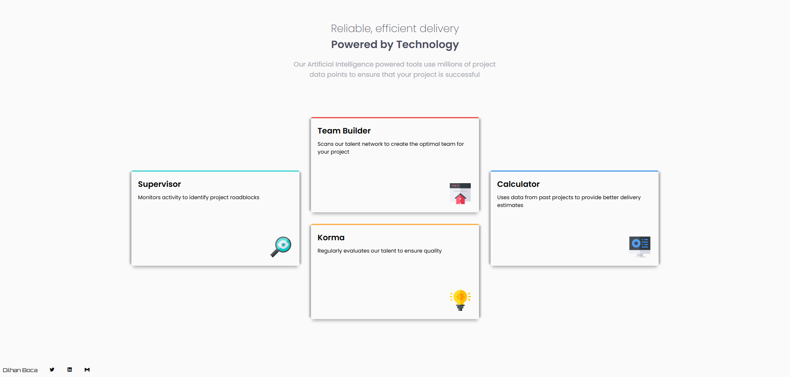

# Frontend Mentor - Huddle Landing Page

## Table of contents

- [Process](#process)
- [Screenshot](#screenshot)
- [What I learned](#what-i-learned)
- [Future Improvements](#future-improvments)
- [Author](#author)

## Process

 I used CSS Grid for the core of the layout. 
It changes from a one column layout on small screens 
to a three-part column on larger screens. The auto 
top and bottom margins have kept in in the middle. 

*I've also used position: relative on the cards
so I can position the image absolutely.* 

## Screenshot

;

## What I learned

That I can center a container vertically within the 
context of a grid container using auto margins. 

## Future Improvements

I need to learn how to get to get the box-shadow 
perfectly even on a card even when it has border-radius.

## Author 

Dilhan Boca

- Frontend Mentor - [@dboca93](https://www.frontendmentor.io/profile/dboca93)
- Twitter - [@dboca93](https://www.twitter.com/dboca93)

dboca93@gmail.com